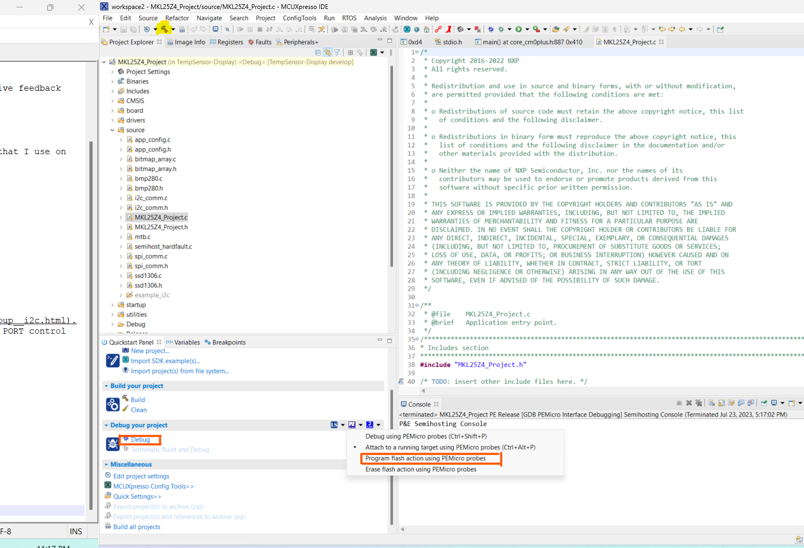

# LORA SX-1278 Communication using FRDM-KL25 (FreeRTOS enabled)

## Overview
This is a (work in progress) project where an MCU (FRDM-KL25 dev board) is used to communicate to another MCU using Semtech's SX-1278 chip that uses the Low-Range (LoRa) radio communication. The MCU is interfaced with the module via SPI power supply given from a PC.

I am releasing this as a project that can run on FreeRTOS or baremetal. Why add an OS onto a fairly simple project, you ask? This is because I am still working on developing this into something more useful (see the section on Works in Progress). However, some of the API's I've made to work with LORA could be of some use to the community, and hence pushing this working PoC at this stage.

I'm happy to also receive feedback on the same.

## Important Pointers about this Project
The goal of this is to make availble the source code to the community, so it can be tweaked and experimented with or also as a good starting point to learn how to use a FRDM development board (although we have a global supply shortage of these!) 
Where the Project is at right now:
1. The board can initialize and set the LORA module as a TX or RX (under very specific settings that can be re-configured in the code).
2. It can send a payload (although I've not abstracted this enough to send any payload). Again, the user can tweak this to his application.
3. Once TX of payload is complete, an interrupt is raised from the module to the MCU notifying the same. A TX payload is sent every 15s.
4. Any MCU on the receiving end (whose Lora RX is also under very specific settings configured as the TX) is capable to receive this transmitted payload.
5. Once the Lora RX module detects a packet in the air and captures it, it raises an interrupt notifying the MCU of the same.
6. The obvious note is that if you want to try out this project, you need two FRDM boards, one as a TX and the other as an RX.
7. The communicating carrier frequency was kept at 434MHz to keep with international and local license-free bands of operation. If you are changing the communicating frequencies, do so at your own risk!

Development IDE : MCUXpresso

Programming Language : C

## Getting Started

### Schematic

Picture of the TX.

Picture of the RX.

For instructions concerning the wiring of the SSD1306 display, check out my other [repo](https://github.com/jsj3408/TempSensor-Display).

### Program Structure
1. All the files meant for build are in the "source" directory.
2. The int main(void) function is located inside the MKL25Z4_Project.c file.
3. The files inside the source directory are cluttered and still need to be tidied up to be in their respective subdirectories.

### Documentation Links
Below are the sources that helped me through this project

1. [FRDM-KL25 User Manual](https://www.mouser.com/pdfdocs/FRDM-KL25Z.pdf)
2. [FRDM-KL25's Pinouts](https://www.openhacks.com/uploadsproductos/frdm-kl25z_pinouts__rev_1.0_.pdf)
3. Have a look through NXP's APIs online that could be used to configure GPIO's, set up SPI, etc, like [this for example](https://mcuxpresso.nxp.com/api_doc/dev/116/group__spi.html).
4. Or manually configure them by referring to the Reference Manual [here](https://spivey.oriel.ox.ac.uk/dswiki/images-digisys/5/56/KL25-refman.pdf).
5. Study (yes, study! scribble! devour!) Semtech SX-1278 [datasheet](https://cdn-shop.adafruit.com/product-files/3179/sx1276_77_78_79.pdf).

## Usage

### Importing Project
1. Make sure MCUXpresso is downloaded and open a workspace
2. Download this git repo and then go to File->Open Projects From File System
(pic coming soon!)
3. Go to the path directory and select this folder(shown in below pic) and click Finish
(pic coming soon!)
4. The project should be opened as shown below. 
(pic coming soon!)

### Configure Source Code, Build and Flash

#### Build Baremetal
1. Go to ProjConfig->app_config.h file and ensure that the macro BAREMETAL is defined.
2. To build the .bin file for the transmitter, ensure that the macro LORA_TX is defined and the macro LORA_RX is commented out.

3. Using the hammer button, you can build to generate the .bin and .axf files for flash and debug.
4. Power up the FRDM-KL25Z on the SDA USB port (the port on the right if the ports face down) that needs to be configured as the TX.
5. Next, to flash either flash directly as shown in the pic below and selecting "Program Flash Action Using PEMicro probes"
6. Or just click on the Blue beetle that says "Debug", which flashes and enters into Debug mode via openSDA.

7. Repeat steps 2 - 6 for configuring another MCU as the receiver, defining LORA_RX and commenting out LORA_TX.

#### Build using FreeRTOS
1. Go to ProjConfig->app_config.h file and ensure that the macro BAREMETAL is commented out.
2. To build the .bin file for the transmitter, ensure that the macro APP_TX is defined and the macro APP_RX is commented out.
3. Using the hammer button, you can build to generate the .bin and .axf files for flash and debug.
4. Power up the FRDM-KL25Z on the SDA USB port (the port on the right if the ports face down) that needs to be configured as the TX.
5. Next, to flash either flash directly as shown in the pic below and selecting "Program Flash Action Using PEMicro probes"
6. Or just click on the Blue beetle that says "Debug", which flashes and enters into Debug mode via openSDA.
7. Repeat steps 2 - 6 for configuring another MCU as the receiver, defining APP_RX and commenting out APP_TX.
8. If you have the ability to use a screen (like an SSD1306) and want  to display payload with SNR and RSSI, then enable macro USE_DISPLAY. Else keep it disabled

### Runtime Operation

#### Baremetal operation
You can either rely on debug print by OpenSDA(which makes the whole operation super slow!!) or - better yet - use the LED lights I've set up as indications.
1. If you set up an MCU as a TX, you will see white light - which means config is complete and TX is in process and then blue light - which means the TX is done. If you see a pink light, that means TX failed.
2. If you set up an MCU as a RX, you will see white light - which means config is complete and the module is listening for data. If you see blue light, this means we have finished receiving a packet and you can see it in the prints. Else you might see a pink light(which means a failure in whatever case).

#### FreeRTOS operation
Sorry, I only have OpenSDA prints available in this mode. No helpful LED lights :( . This is why I found it helpful to have a screen to display the paylaod. I hope to use the LED lights soon.

## Results
Check out [my post](https://yellowseas.wordpress.com/) on LoRa's range performance and some other things as well.

## Works in Progress
1. Make the API's more modular for portability.
2. Be able to send and receive custom user-defined packets in real time.
3. Explore communication between more nodes without a gateway.
4. Distance (range tests) to be improved
